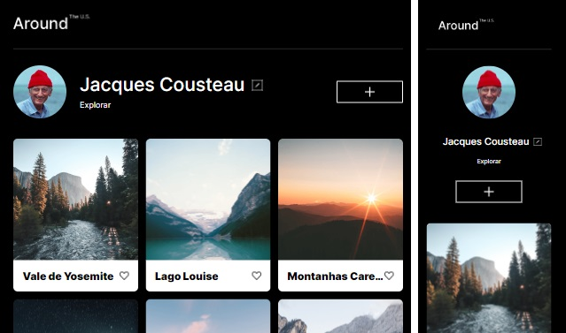

**Projeto**

EUA Afora

**Descrição**
Este é um projeto web chamado "EUA Afora" que exibe uma página com um perfil de usuário e uma seção de elementos. O objetivo do projeto é mostrar o exemplo de um perfil de usuário onde podem ser inseridos dados novos através do botão de edição ao lado do nome do perfil.
Você também pode ver uma sessão abaixo onde fotos poderão ser inseridas com botões de curtir abaixo das fotos.

Recursos Utilizados
O projeto utiliza os seguintes recursos:

HTML: O código HTML é responsável pela estrutura e organização da página.
CSS: Há um arquivo CSS externo que contém estilos para estilizar os elementos e a aparência geral da página.
Imagens: O projeto faz uso de várias imagens que são exibidas na seção de elementos, no perfil de usuário e no cabeçalho.
JavaScript: Há um arquivo JavaScript externo que contém funcionalidades interativas, como abrir e fechar um popup de edição do perfil.

**Github Page**

Clique no link abaixo para visitar a página.

https://brunocarletti182.github.io/web_project_4_ptbr/

**Imagens do projeto**

